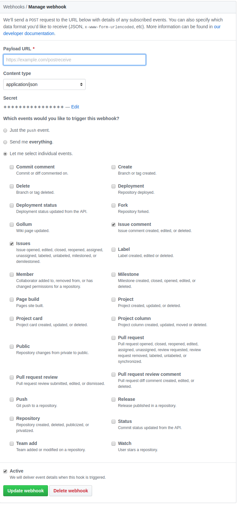

#anpr-github-privacy-check
Questo progetto usa express per esporre un endpoint in POST /github sfruttando le [webhook di github](https://developer.github.com/webhooks)
In particolare si fa uso di [IssueCommentEvent](https://developer.github.com/v3/activity/events/types/#issuecommentevent) per ricevere eventi riguardo la creazione/aggiornamento di commenti a issue e [IssuesEvent](https://developer.github.com/v3/activity/events/types/#issuesevent)  per ricevere eventi rigaurdo la creazione e aggiornament odi issues su github.
Per configurare le web hooks di github si consiglia di configurarle per l'utente 'italia' come in questa figura:

##Configurazioni
####Github credentials and web hook secret
Le github credentials sono configurabili obbligatoriamente nel file credentials.json.
Il credentials.json ha i seguenti parametri configurabili

####Warning message
Con questa libreria è possibile configurare il messaggio di warning che viene mandato nel momento in cui qualcuno pubblica un'informazione privata.
Si veda il file config.json
####Security checks
Inoltre si possono configurare molto facilmente i security checks da eseguire su
